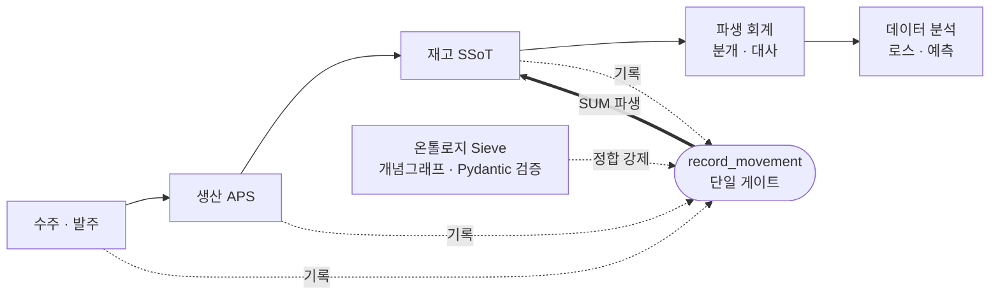
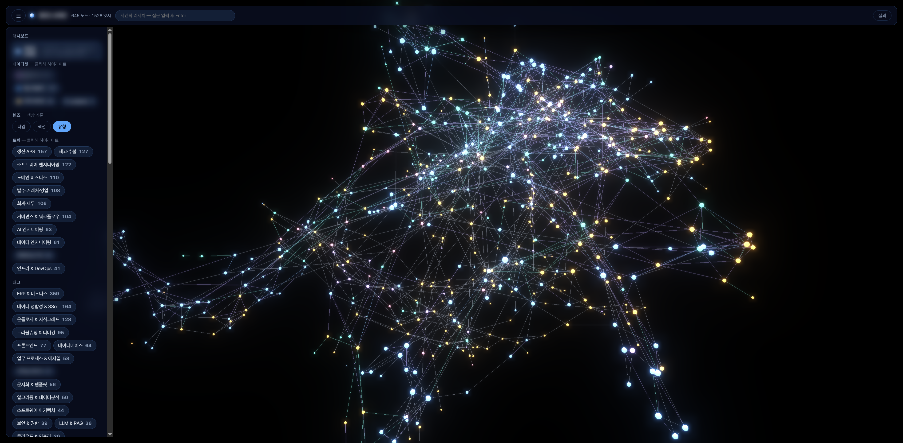

# 문기오 — 제조 현장을 데이터 구조로 바꾸고 그 위에 AI를 얹는 엔지니어

> 자체 소프트웨어가 0이고 업무 데이터가 6\~7곳에 흩어져 있던 **18인 제조·화학 중소기업**에, 웹 ERP를
> **1인으로 설계·구축**해 실운영에 안착시켰습니다 (재직 2026.04\~2026.07 · 입사 4주 차 첫 실가동 →
> 약 2개월에 걸쳐 14개 업무 도메인 확장). **데이터 정합(DX)을 먼저 세우고 그 위에 자동화·AI(AX)를 얹는**
> 순서로 일합니다 — 정형 백본 위에 온톨로지 검증 레이어, 비정형 16GB를 다루는 시멘틱 문서허브(RAG),
> 카톡 문의 응답 에이전트까지.

**In English** — Solo design, build and operation of a cloud full-stack ERP (FastAPI · React · PostgreSQL ·
Cloud Run) for an 18-person manufacturing/chemical SME in Korea — first production use four weeks in,
expanded to 14 business domains over ~2 months. I build **DX first** (one event-sourced backbone with
domain-ontology validation), then **layer AX on top** (a semantic document hub over 16GB, LLM intake agents).
Also: open-source AI-agent tooling ([harness-scope](https://github.com/moongioh/harness-scope)) whose fix was
adopted upstream by Arize, and a self-hosted AI stack ([agent-memory-llmops](https://github.com/moongioh/agent-memory-llmops)).

🖥 **[포트폴리오 홈](https://moongioh.github.io/manufacturing-ax-portfolio/)** · 📄 **[이력서](https://moongioh.github.io/manufacturing-ax-portfolio/resume.html)** · 📧 awsgioh@gmail.com
⚙ **OSS · 개인 R&D:** [harness-scope](https://github.com/moongioh/harness-scope) (에이전트 거버넌스 관측 · Apache-2.0) · [agent-memory-llmops](https://github.com/moongioh/agent-memory-llmops) (자가호스팅 AI 스택 아키텍처 쇼케이스)

---

## 한눈에 — 30초 스캔

| | |
|---|---|
| **실물 (프로덕션)** | 자체 SW 0 → **14도메인 웹 ERP 1인 구축** · 입사 4주 차 실가동 · 무중단 전환 · 실운영 안착. 진실원천 **6\~7곳 → 단일 이벤트소싱 백본** |
| **AX-on-DX** | 데이터 정합(DX) 위에 AI(AX): 온톨로지 검증 레이어 · **시멘틱 문서허브**(RAG·pgvector·2,809문서) · LLM 문의 응답 에이전트 |
| **AI-native 방식** | 개발을 AI 에이전트와 — 그 **작업 규율을 도구화**해 오픈소스 공개 ([harness-scope](https://github.com/moongioh/harness-scope)) |
| **OSS 업스트림 기여** | 그 도구가 잡은 토큰 계측 버그를 **LLM 관측 대표도구 Phoenix를 만든 Arize의 오픈소스에서 재현·수정 → 메인테이너가 내 패치를 작성자 보존·크레딧과 함께 채택해 메인 브랜치에 병합** |
| **AI 인프라 깊이** | 자가호스팅 AI 스택 개인 R&D — 에이전트 장기기억(지식그래프·RAG·MCP) + LLMOps 게이트웨이 ([agent-memory-llmops](https://github.com/moongioh/agent-memory-llmops)) |

> 지향 역할: 현장에 들어가 문제를 구조화하고 도는 시스템으로 안착까지 책임지는 **FDE형 엔지니어**. 목적지는 산업의 일하는 방식을 바꾸는 **AX**.

---

## 이 저장소는 무엇인가 (공개 범위)

18인 제조·화학 중소기업의 ERP를 **1인으로 설계·구축**해 실제 운영에 투입한 프로젝트의 공개 포트폴리오입니다.

- 실제 운영 시스템의 **전체 소스는 NDA·보안 규정으로 비공개**입니다.
- 이 저장소에는 **기밀·회사 식별정보가 제거된** (1) 화면 둘러보기(주요 화면 스크린샷), (2) 아키텍처 워크스루 23종, (3) 이력서를 담았습니다.
- 화면은 **더미 데이터 + 백엔드 없는 정적 빌드**에서 캡처 — 영업비밀·회사 식별정보 노출 0. 커밋 히스토리는 익명화를 위해 스쿼시 후 재게시했습니다. 동작하는 시스템은 **요청 시 라이브 데모 구동**으로 직접 확인하실 수 있습니다.

---

## ① 실제 시스템 — 제조 웹 ERP (프로덕션 성과)

관리자 주요 화면을 더미 데이터로 시연합니다 (약 2초 간격 자동 재생 · 한 화면씩 크게: **[인터랙티브 슬라이드쇼](https://moongioh.github.io/manufacturing-ax-portfolio/slides.html)**).

**아키텍처 한 줄 원리 — 「모든 변화는 사건(event)으로 기록하고, 숫자는 그 사건들에서 파생한다」**
재고도·매출도·자금도 저장된 "현재값"이 아니라 **이력의 합(SUM)**입니다. 수주 → 생산(APS) → 재고(SSoT) → 파생 회계 → 데이터 분석이 하나의 게이트(`record_movement`)로 모이고, 온톨로지 Sieve가 적재 전 정합성 위반을 걸러냅니다.

**임팩트 (before → after)**

| 항목 | before | after |
|---|---|---|
| 생산지시서 작성 | 수작업 **건당 ~40분** | 자동 추천 **1클릭** |
| 발주 관리 | 다중 SSoT 정합 **하루 ~2시간** | **실시간 발주서 보드** |
| 진실 원천 | **6~7곳 분산** | **단일 정합 백본** |
| 재고 정합 | **3~4개월 실사 = 리셋 반복** | 이벤트소싱 수불부 (사건의 합) |
| 경영 현황 | 실시간 집계 수단 부재 | 실시간 KPI |
| 비정형 문서 | 16GB 분산·검색 불가 | **시멘틱 문서허브**(임베딩 검색·RAG 초안) |

**종단 재구축 범위** — 부분 개선이 아니라 사업 운영 데이터 구조 전체를 단일 이벤트소싱 백본으로 교체:
`수주·문의` · `발주·출고` · `생산계획(APS)` · `생산일지·로스` · `재고(SSoT)` · `자금·채권` · `관리회계·손익` · `거래처 마스터` · `샘플관리` · `배차` · `권한·감사(RBAC)` · `온톨로지·AX` · `문서허브(RAG)` · `인프라·배포`

| 규모 | 값 |  | 규모 | 값 |
|---|---|---|---|---|
| 구축·운영 | **1인** (4주차 실가동) |  | 거래처 마스터 정합 | **973건** |
| 재구축 도메인 | **14개** |  | 온톨로지 개념그래프 | **203개념·233엣지** |
| 진실원천 통합 | **6~7곳 → 1** |  | 문서 임베딩 적재 | **2,809문서·13,759청크** |

> **설계 결정 열람 (워크스루 23종)** — GitHub Pages 링크로 여세요(저장소 `.html`은 소스로만 보임):
> [▶ 시스템 오버뷰](https://moongioh.github.io/manufacturing-ax-portfolio/walkthroughs/워크스루-시스템오버뷰.html) · [전체 인덱스 허브](https://moongioh.github.io/manufacturing-ax-portfolio/walkthroughs/워크스루.html) — 핵심: [재고 이벤트소싱](https://moongioh.github.io/manufacturing-ax-portfolio/walkthroughs/워크스루-재고이벤트소싱.html) · [온톨로지](https://moongioh.github.io/manufacturing-ax-portfolio/walkthroughs/워크스루-온톨로지.html) · [APS 생산계획](https://moongioh.github.io/manufacturing-ax-portfolio/walkthroughs/워크스루-APS.html) · [문서허브(RAG)](https://moongioh.github.io/manufacturing-ax-portfolio/walkthroughs/워크스루-문서허브.html) · [거버넌스](https://moongioh.github.io/manufacturing-ax-portfolio/walkthroughs/워크스루-거버넌스.html)

---

## ② AI-Native — 어떻게 만들었나 · 무엇을 이어가나

이 시스템은 대부분 **AI 코딩 에이전트와 함께** 개발했습니다. 1인이 이 범위를 이 기간에 다룬 것은 개인 코딩 속도가 아니라 **에이전트의 실수를 줄이는 작업 규율을 문서·훅으로 강제**했기 때문입니다 — 계획 게이트 · pre-commit 기계강제 · 구현/검증 에이전트 분리 · 온톨로지를 에이전트 컨텍스트로 공급.

**이 방식을 도구화하고, 업스트림 OSS에도 기여했습니다:**

- **[harness-scope](https://github.com/moongioh/harness-scope)** — 에이전트 세션 로그를 턴 단위로 판정하는 거버넌스 관측 도구. **Apache-2.0 오픈소스**(`pip install hscope` · npm `hscope` · 3-OS CI · MCP 서버 10툴).
- **OSS 업스트림 기여** — harness-scope가 **자체 룰로** 토큰 이중계산 버그를 탐지 → 같은 결함이 **LLM 관측 분야 대표 도구 Phoenix를 만든 Arize의 오픈소스**에도 실재함을 재현·확인(출력 2.79× 과다계산) → 패치 제출 → **메인테이너가 내 패치를 작성자 보존·크레딧과 함께 채택해 메인 브랜치에 병합** ([PR #84](https://github.com/Arize-ai/coding-harness-tracing/pull/84)). *내가 만든 도구가 대표 프로젝트에서 실제 결함을 잡아 고쳐 업스트림에 반영된 기여.*

**이 하네스 엔지니어링은 개인 R&D로도 이어집니다** — 자가호스팅 AI 스택 하나로 응축:

- **[agent-memory-llmops](https://github.com/moongioh/agent-memory-llmops)** (아키텍처 쇼케이스) — **에이전트 장기기억**(645노드 개념그래프 · 3채널 RRF 검색(LLM 0콜) · **LangGraph** RAG · **MCP 서버**)이 **LLMOps 백본**(LiteLLM 게이트웨이 · 가상키+예산캡 · Phoenix 관측·FinOps) 위에서 도는 개인 AI 플랫폼. 구조도·방법론·마스킹 발췌 공개(실코드/코퍼스 비공개).

---

## Tech Stack

- **Frontend**: React · TypeScript · Tailwind CSS · TanStack Query · Vite
- **Backend**: Python · FastAPI · Pydantic · SQLAlchemy / Alembic
- **Data / Modeling**: PostgreSQL · pgvector(시멘틱 검색) · pandas · scipy · networkx(온톨로지 그래프)
- **Cloud / Infra**: Google Cloud Run · Cloud SQL · Cloudflare Access(Zero-Trust SSO) · Vercel · Docker
- **AX / AI**: RAG 파이프라인(RRF 하이브리드) · **LangGraph(StateGraph) 오케스트레이션** · **MCP 서버 구현·운영** · **LLM 게이트웨이(LiteLLM)·관측(Phoenix/OTLP) = LLMOps** · **에이전트 장기기억(지식그래프)** · 임베딩 검색 · LLM 기반 데이터 분류 · Vertex AI · 온톨로지(개념그래프·정합검증) · 이벤트소싱
- **Practice**: Git · Cloud Build CI/CD · GitHub Actions(3-OS) · 오픈소스 배포(PyPI/npm) · 계획 기반 개발 + 자동 핸드오버 문서화

---

## 라이브 데모

화면은 상단 GIF와 [슬라이드쇼](https://moongioh.github.io/manufacturing-ax-portfolio/slides.html)로 볼 수 있습니다. 동작하는 라이브 데모(백엔드 없이 MSW mock·더미 데이터)는 **요청 시 링크로 공유**합니다 — awsgioh@gmail.com
