# Forward Deployed Engineer / AX Engineer — 포트폴리오

> **자체 소프트웨어가 없고 업무 데이터가 6~7곳에 흩어져 있던 18인 제조·화학 중소기업에서, 약 2개월 만에 데이터를 단일 정합 구조로 옮기고 그 위에 웹 ERP를 1인으로 설계·구축 완료하여 운영 중입니다.**
> 정형 백본 위에 **비정형 16GB를 검색하는 RAG 시멘틱 문서허브**까지 얹었고, 이를 가능케 한 AI 거버넌스 방법론은 **오픈소스 [harness-scope](https://github.com/moongioh/harness-scope)** 로 공개했습니다.
> 제조/화학에서 수행했고, 접근 방식은 특정 도메인에 종속되지 않습니다.

**In English** — Forward Deployed Engineer / AX solution architect portfolio: solo end-to-end design, build and
operation of a cloud full-stack ERP (FastAPI · React · PostgreSQL · Cloud Run) for an 18-person manufacturing/chemical
SME in Korea, shipped to production in about two months. Unified 6–7 scattered sources of truth (legacy ERP exports,
paper orders, KakaoTalk, fax, handwritten shop-floor notes, keyless spreadsheets) into a single event-sourced data
backbone with domain-ontology validation; added a RAG semantic document hub over 16GB of unstructured files; and
open-sourced the AI-governance methodology behind that delivery speed as
[harness-scope](https://github.com/moongioh/harness-scope) (Apache-2.0, `pip install hscope`). The domain was
manufacturing/chemicals; the approach is domain-agnostic.

🖥 **포트폴리오 홈(브라우저): https://moongioh.github.io/manufacturing-ax-portfolio/** · 📄 **[이력서](https://moongioh.github.io/manufacturing-ax-portfolio/resume.html)**
📧 **awsgioh@gmail.com** · 🖼 **화면 둘러보기: [slides.html](slides.html)** (라이브 데모는 요청 시) · ⚙ **오픈소스: [harness-scope](https://github.com/moongioh/harness-scope)**

> `.html` 워크스루는 GitHub에서 소스로만 보입니다 — **위 "포트폴리오 홈" 링크(GitHub Pages)**에서 렌더된 화면으로 열람하세요.

---

## 이 저장소는 무엇인가

18인 제조·화학 중소기업의 ERP를 **입사 2개월 만에 1인 종단(End-to-End)으로 설계·구축**하고 실제 운영에 투입한 프로젝트의 공개 포트폴리오입니다.

- 실제 운영 시스템의 **전체 소스는 NDA·보안 규정으로 비공개**입니다.
- 이 저장소에는 **기밀·회사 식별 정보가 제거된 (1) 화면 둘러보기(주요 화면 스크린샷 슬라이드), (2) 아키텍처 워크스루 문서, (3) 이력서**를 담았습니다.
- 화면은 **더미 데이터 + 백엔드 없는 정적 빌드**에서 캡처한 것이라 영업비밀·회사 식별정보 노출이 0입니다. 라이브 데모는 요청 시 안내드립니다.

| 자원 | 위치 | 설명 |
|---|---|---|
| **화면 둘러보기** | [slides.html](slides.html) | 관리자 주요 메뉴를 더미 데이터로 시연(스크린샷 슬라이드). 발주→생산→재고 연쇄. 라이브 데모는 요청 시 |
| **워크스루 문서** | [`walkthroughs/`](./walkthroughs) | 도메인·설계 결정을 다이어그램으로 설명한 인터랙티브 문서 23종 |
| **오픈소스** | [moongioh/harness-scope](https://github.com/moongioh/harness-scope) | AI 에이전트 거버넌스 관측 도구 (Apache-2.0 · `pip install hscope`) — 별도 공개 저장소 |
| **이력서** | [resume.html (Pages)](https://moongioh.github.io/manufacturing-ax-portfolio/resume.html) | 상세 경력·케이스 스터디 |

---

## 🖼 화면 둘러보기

관리자 주요 화면을 **더미 데이터**로 시연합니다. 인터랙티브 슬라이드(키보드·다크모드): **[slides.html](slides.html)** · 라이브 데모는 요청 시 안내.

**1. 홈 · 업무 흐름 대시보드** — 수주 → 생산 → 재고 → 회계를 하나의 흐름으로 한 화면에. 각 단계를 클릭하면 해당 업무로 직행.

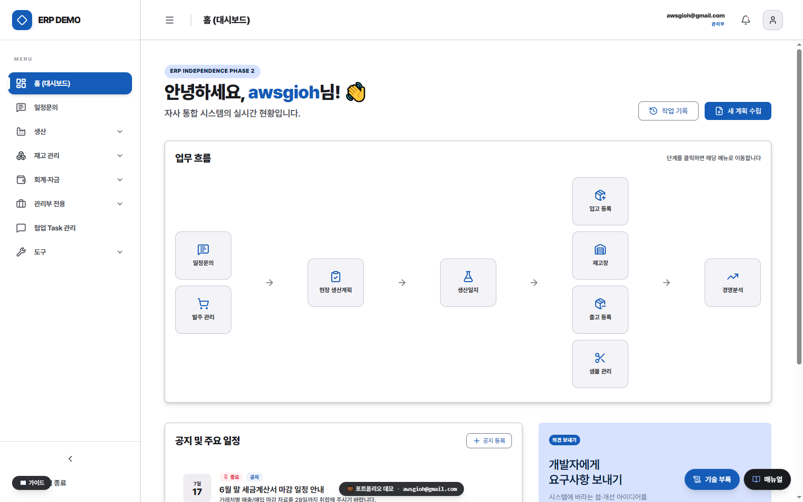

**2. 발주서 보드** — 발주(헤더–라인–스케줄)가 생산·승인·이행·출고 상태로 살아 움직인다. 부분출고·잔량 추적.

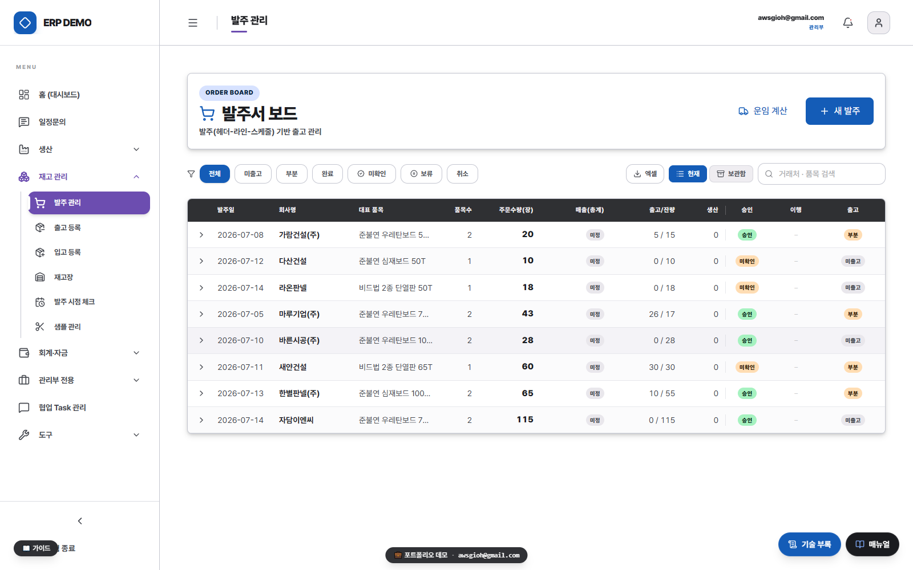

**3. 재고장** — 재고는 저장된 “현재값”이 아니라 수불 이력의 합(SUM). 음수(결손 신호)는 항상 노출.

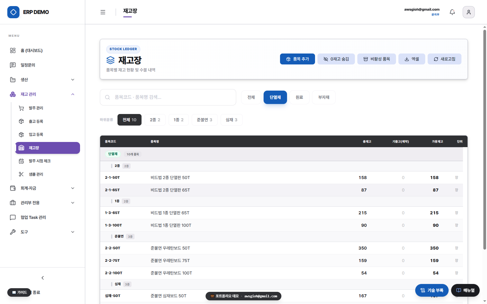

**4. 현장 생산계획 (APS)** — 생산 큐 + 현장 모바일 입력. 완료 수량이 생산일지·재고로 그대로 흐른다.

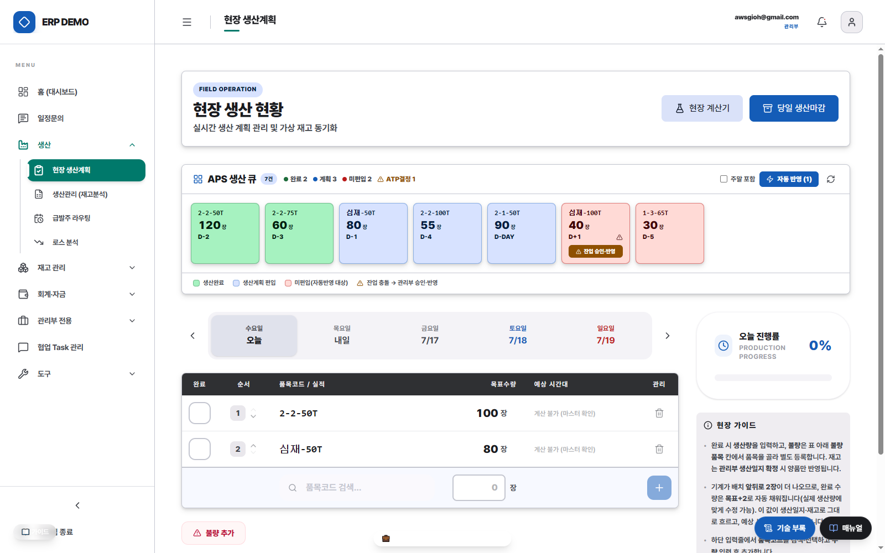

**5. 생산일지** — 엑셀 탈피·실시간 DB 적재. 유량계 실측 vs 이론 계산 대사 + 원가율 자동 통제.

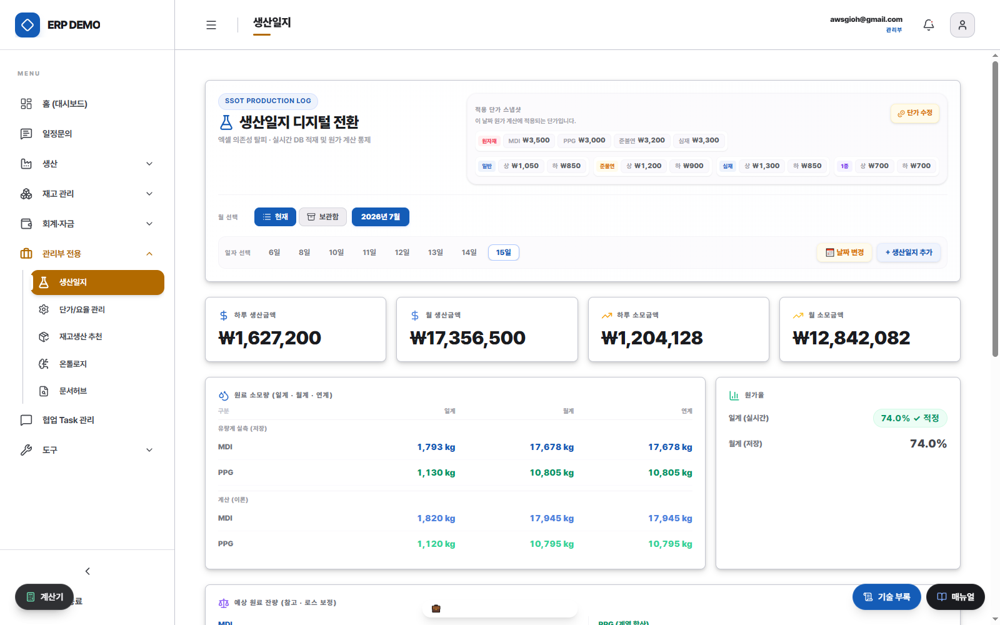

**6. 로스 분석** — 원료 로스를 품목·조건별로 회귀 귀속하고 쌓일수록 정밀해지는 경험계수. 영업비밀 계수는 마스킹.

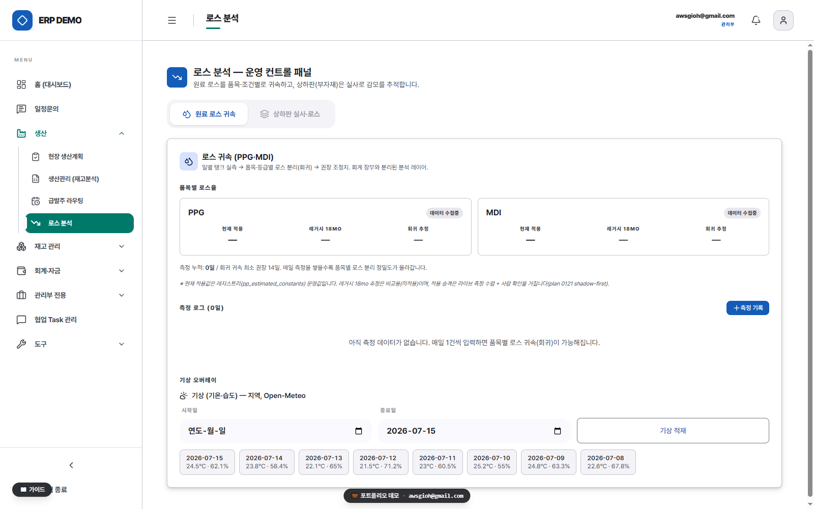

**7. 자금일보** — 계좌별 마감잔액(실측) + 미수·어음·고정비에서 파생한 입출금 예정. 실지급은 사람이 확정.

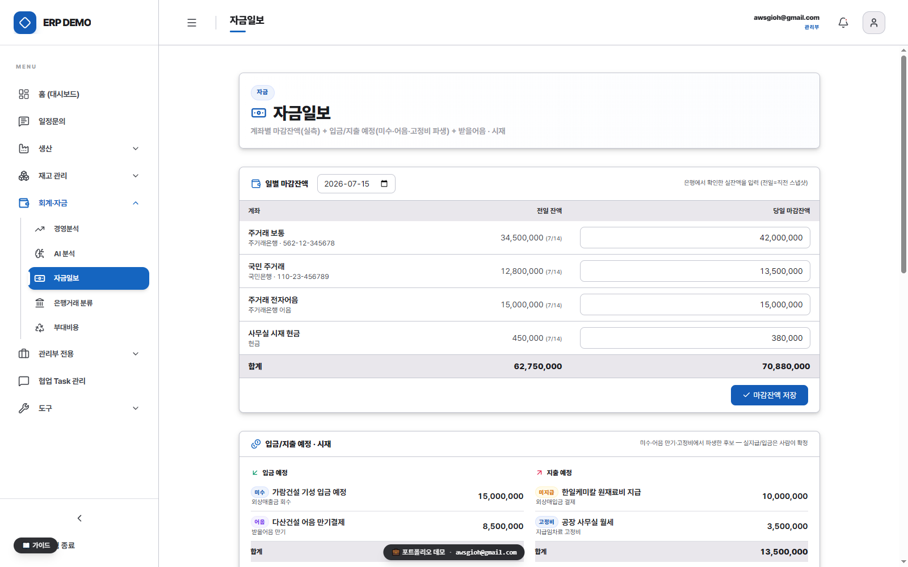

**8. 경영분석 콘솔** — 발주 기준 매출·원가율·세무·채권채무를 한 콘솔에서. 12개월 추이 실시간 집계.

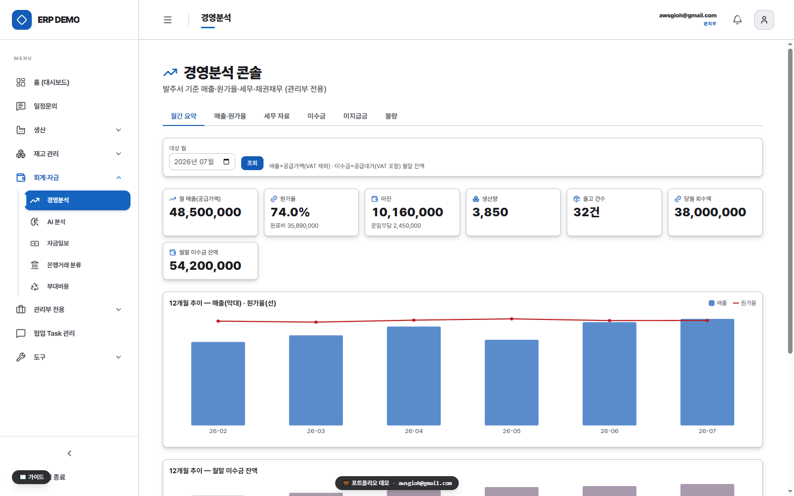

**9. 자기보정 온톨로지** — 도메인 개념그래프 + DB가 쌓일수록 정확해지는 경험계수. 팔란티어식 개념 탐색.

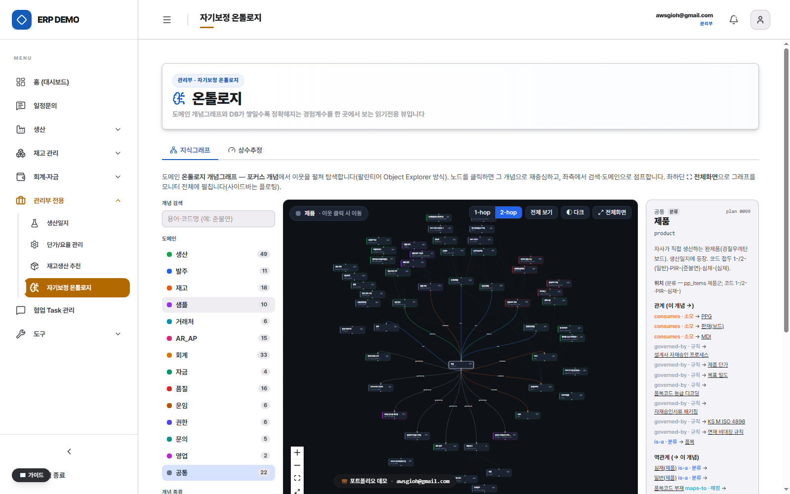

**10. 통합 관리 콘솔** — 스택·규모·다층 보안·RBAC·기술명세를 한 눈에.

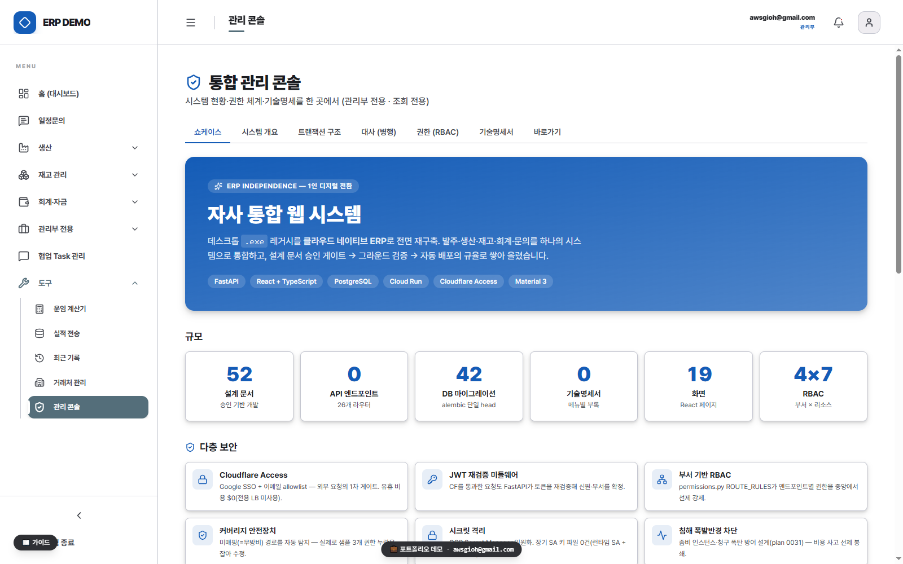

**11. 재고생산 추천** — 회전 빠른 품목을 라인 여유분에 발주 확정 전 선제 생산 제안(투기적·사람 통제).

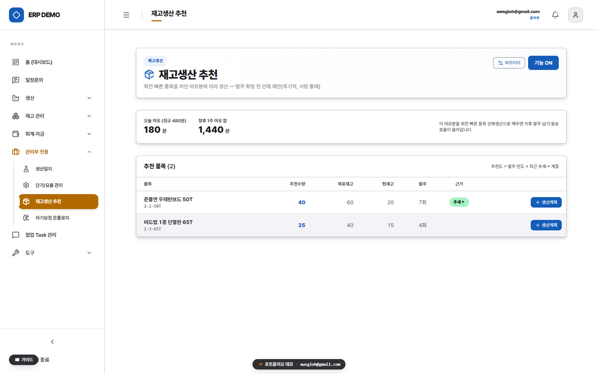

**12. 모바일 라이트** — 현장은 폰으로. 재고·발주를 풀스크린 경량 화면으로.

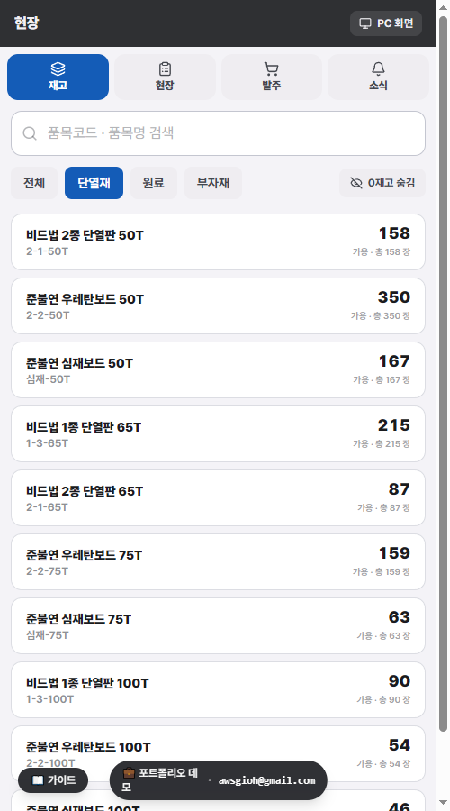

> 화면의 거래처·품목·금액·계좌는 전부 시연용 더미이며, 회사 식별정보·영업비밀(로스율·배합비·계수)은 마스킹되어 포함되지 않습니다.

---

## 핵심 역량 (4 Pillars)

1. **데이터 정합 구조 (Data Integrity Backbone)** — 6~7곳에 분산됐던 다중 SSoT(이카운트·종이 발주서·카톡·팩스·현장 수기 노트·현장 사진·식별키 없는 엑셀)를 도메인 온톨로지·검증 레이어로 강제한 **단일 정합 데이터 백본**.
2. **AX 기틀 (Ontology-Driven AX)** — 비정형 비즈니스 규칙을 그래프로 구조화한 **온톨로지 Sieve(체)** + 의사결정 레이어. 데이터 정합 위에 자율화가 얹히는 기틀.
3. **루트 코즈 진단 (Root-Cause Structuring)** — 증상(입력이 느리다·재고가 안 맞는다)이 아니라 근본 원인(SSoT 분산 → 데이터 거버넌스 공백 → 특정 담당자 의존)으로 구조화하고, 각 코즈를 후속 실행 계획에 1:1 매핑.
4. **변화 관리 (Change Management)** — 예산이 없던 출발점에서 프로토타입으로 가치를 먼저 증명·설득해 실가동까지 안착.

---

## 🤖 AI-Native Engineering — 속도의 구조

전체 시스템을 **약 2개월** 만에 1인으로 설계·구축하고 안정적으로 운영할 수 있었던 이유는 **AI를 프로덕션 수준의 정합성으로 통제하는 개발 거버넌스**를 구축했기 때문입니다. "AI를 쓴다"가 아니라, AI가 실수 없이 일하도록 규율을 코드·문서로 강제하는 쪽 — 자율화를 안전하게 이륙시키는 이 방법론 자체가 AX 실행 역량의 직접 증거입니다.

- **계획 게이트 개발** — 모든 비트리비얼 작업은 승인된 계획 문서를 거쳐 착수. 결정·트레이드오프·검증 기준을 먼저 확정.
- **거버넌스 기계 강제** — 상태/로그 크기 캡·규칙 드리프트 검사·커밋 게이트를 pre-commit 훅으로 자동화(규율이 도구로 유지).
- **멀티에이전트 검증** — 구현과 검증을 분리해 독립 에이전트가 diff를 적대적으로 리뷰(자기확증 편향 구조적 차단).
- **온톨로지 = 에이전트 컨텍스트** — 도메인 개념그래프를 에이전트의 코드 내비·정합 근거로 공급(AI가 도메인을 추측 않고 정본에서 착지).

> 설계·운영 방식은 [`워크스루-거버넌스`](https://moongioh.github.io/manufacturing-ax-portfolio/walkthroughs/워크스루-거버넌스.html)에서 다이어그램으로 확인할 수 있습니다.

**이 방법론은 산문으로 끝나지 않습니다** — 에이전트 세션 로그를 턴 단위로 판정하는 관측 도구 **[harness-scope](https://github.com/moongioh/harness-scope)** 를 Apache-2.0 오픈소스로 공개했습니다 (`pip install hscope` · npm `hscope` · 3-OS CI · MCP 서버 10툴).


---

## 임팩트 (before → after)

| 항목 | before (전환 이전 실측) | after |
|---|---|---|
| 생산지시서 작성 | 수작업, **건당 ~40분** | 자동 추천 **1클릭**, 작성자 제약 해소 |
| 발주 관리 | 다중 SSoT 정합 맞추기 **하루 ~2시간** | **실시간 발주서 보드**, 정합 유지 비용 소멸 |
| 진실 원천 | **6~7곳 분산** | **단일 정합 백본** |
| 재고 정합 | **3~4개월 실사 = 리셋 반복** (원인 추적 실패) | 이벤트소싱 수불부 (사건의 합) |
| 경영 현황 | **실시간 집계 수단 부재** | 실시간 KPI |
| 비정형 문서 | 16GB가 폴더·개인 PC에 분산, 검색 불가 | **시멘틱 문서허브** (임베딩 검색 · 정본 레지스트리 · RAG 초안) |

---

## 🧩 종단 재구축 범위 (End-to-End Scope)

부분 기능 개선이 아니라 **사업 운영 데이터 구조 전체를 단일 이벤트소싱 백본으로 교체**했습니다. 하나의 게이트(`record_movement`) 위에 아래 업무 도메인이 통합돼 있습니다.

`수주·문의` · `발주·출고` · `생산계획(APS)` · `생산일지·로스` · `재고(SSoT)` · `자금·채권` · `관리회계·손익` · `거래처 마스터` · `샘플관리` · `협업·Task` · `배차` · `권한·감사(RBAC)` · `온톨로지·AX` · `문서허브(시멘틱 검색·RAG)` · `인프라·배포`

| 규모 | 값 |
|---|---|
| 종단 구축·운영 | **2개월 · 1인** (첫 컷오버 4주) |
| 동시 재구축 도메인 | **14+** |
| 진실 원천 통합 | **6~7곳 → 단일 백본** |
| 거래처 마스터 정합 적재 | **973건** |
| 온톨로지 개념그래프 | **203개념 · 233엣지** |
| 비정형 문서 임베딩 적재 | **2,809문서 · 13,759청크** (pgvector) |
| 운영 이력 데이터 이관 | **18개월** |

각 도메인의 설계 결정은 아래 **워크스루** 문서로 열람할 수 있습니다.

---

## 아키텍처 한 줄 원리

> **「모든 변화는 사건(event)으로 기록하고, 숫자는 그 사건들에서 파생한다」**

재고도·매출도·자금도 어딘가 저장된 "현재값"이 아니라 **이력의 합(SUM)**입니다. 수주 → 생산(APS) → 재고(SSoT) → 파생 회계 → 데이터 분석이 하나의 게이트(`record_movement`)로 모이는 이벤트소싱 백본입니다.

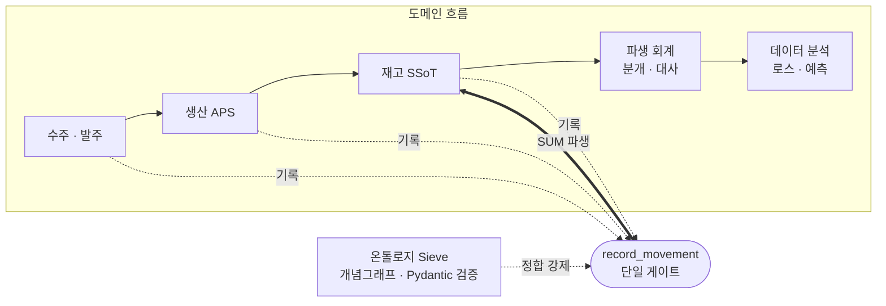

<sub>모든 상태 변화는 `record_movement` 한 길목으로 모이고, 온톨로지 Sieve가 적재 전 정합성 위반을 걸러냅니다.</sub>

---

## 🏛 설계 결정·아키텍처 열람 (워크스루)

도메인·설계 결정을 다이어그램으로 설명한 인터랙티브 문서입니다. **아래는 GitHub Pages 렌더 링크** (저장소의 `.html`은 소스로만 보이므로 이 링크로 여세요):

- **▶ 시작점 —** [시스템 오버뷰](https://moongioh.github.io/manufacturing-ax-portfolio/walkthroughs/워크스루-시스템오버뷰.html) · [전체 인덱스 허브](https://moongioh.github.io/manufacturing-ax-portfolio/walkthroughs/워크스루.html)
- **핵심 —** [재고 이벤트소싱 코어](https://moongioh.github.io/manufacturing-ax-portfolio/walkthroughs/워크스루-재고이벤트소싱.html) · [생산일지 분해(BOM)](https://moongioh.github.io/manufacturing-ax-portfolio/walkthroughs/워크스루-생산일지분해.html) · [온톨로지](https://moongioh.github.io/manufacturing-ax-portfolio/walkthroughs/워크스루-온톨로지.html)
- **도메인 —** [APS 생산계획 자동화](https://moongioh.github.io/manufacturing-ax-portfolio/walkthroughs/워크스루-APS.html) · [발주·출고 SSoT](https://moongioh.github.io/manufacturing-ax-portfolio/walkthroughs/워크스루-발주출고-SSoT.html) · [생산·로스율](https://moongioh.github.io/manufacturing-ax-portfolio/walkthroughs/워크스루-생산로스율.html) · [자금·채권](https://moongioh.github.io/manufacturing-ax-portfolio/walkthroughs/워크스루-자금채권.html) · [관리회계](https://moongioh.github.io/manufacturing-ax-portfolio/walkthroughs/워크스루-관리회계.html) · [마이그레이션](https://moongioh.github.io/manufacturing-ax-portfolio/walkthroughs/워크스루-마이그레이션.html) · [문서허브(시멘틱 검색·RAG)](https://moongioh.github.io/manufacturing-ax-portfolio/walkthroughs/워크스루-문서허브.html)
- **거버넌스 —** [거버넌스 체계](https://moongioh.github.io/manufacturing-ax-portfolio/walkthroughs/워크스루-거버넌스.html) · [권한·감사](https://moongioh.github.io/manufacturing-ax-portfolio/walkthroughs/워크스루-권한감사.html)

> 홈에서 카드로 열람: **https://moongioh.github.io/manufacturing-ax-portfolio/**

---

## Tech Stack

- **Frontend**: React, TypeScript, Tailwind CSS, TanStack Query, Vite
- **Backend**: Python, FastAPI, Pydantic, SQLAlchemy / Alembic
- **Data / Modeling**: PostgreSQL, pgvector (시멘틱 검색), pandas, scipy, networkx (온톨로지 그래프)
- **Cloud / Infra**: Google Cloud Run, Cloud SQL, Cloudflare Access (Zero-Trust SSO), Vercel, Docker
- **AX / AI**: Vertex AI (온디맨드·Read-only 보고 루프), 임베딩 검색(RRF 하이브리드), RAG 파이프라인, MCP 서버, LLM 기반 데이터 분류
- **Practice**: Git, Cloud Build CI/CD, GitHub Actions (3-OS 매트릭스), 오픈소스 배포(PyPI/npm), 계획(plan) 기반 개발 + 자동 핸드오버 문서화

---

## 데모 로컬 실행

```bash
cd demo
npm install
npm run dev          # 개발 서버
# 또는 정적 데모 빌드:
npm run build:demo
```
데모는 백엔드 없이 동작합니다 (MSW가 API를 mock으로 가로채고, 상태는 인메모리 — 새로고침 시 초기 더미로 리셋).
