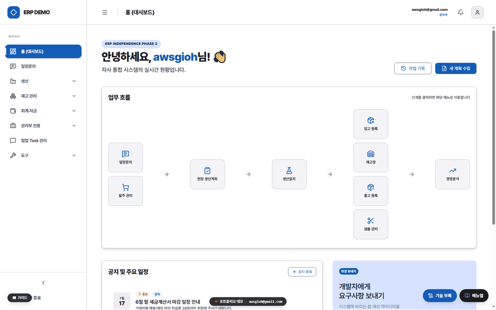
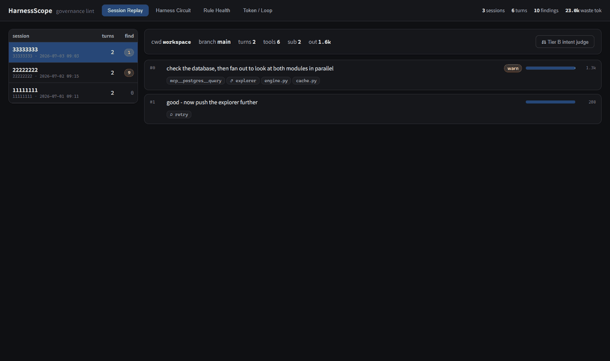

# 제조 중소기업 웹 ERP 1인 구축 — 포트폴리오

> **자체 소프트웨어가 없고 업무 데이터가 6~7곳에 흩어져 있던 18인 제조·화학 중소기업에서, 웹 ERP를 1인으로 설계·구축해 운영 중입니다.**
> 입사 4주 차에 첫 실가동을 시작했고, 약 2개월에 걸쳐 발주·생산·재고·자금·관리회계 등 주요 업무 도메인으로 확장했습니다.
> 정형 백본 위에 **비정형 문서 16GB를 검색하는 시멘틱 문서허브**를 얹었고, 개발에 사용한 AI 에이전트 작업 규율은 **오픈소스 [harness-scope](https://github.com/moongioh/harness-scope)** 로 공개했습니다.

**In English** — Solo design, build and operation of a cloud full-stack ERP (FastAPI · React · PostgreSQL · Cloud Run)
for an 18-person manufacturing/chemical SME in Korea — first production use four weeks in, expanded to the main
business domains over about two months. Unified 6–7 scattered sources of truth (legacy ERP exports, paper orders,
KakaoTalk, fax, handwritten shop-floor notes, keyless spreadsheets) into a single event-sourced data backbone with
domain-ontology validation; added a semantic document hub over 16GB of unstructured files; and open-sourced the
AI-agent workflow tooling used to build it as [harness-scope](https://github.com/moongioh/harness-scope)
(Apache-2.0, `pip install hscope`).

🖥 **포트폴리오 홈(브라우저): https://moongioh.github.io/manufacturing-ax-portfolio/** · 📄 **[이력서](https://moongioh.github.io/manufacturing-ax-portfolio/resume.html)**
📧 **awsgioh@gmail.com** · 🖼 **화면 둘러보기: [슬라이드쇼](https://moongioh.github.io/manufacturing-ax-portfolio/slides.html)** (아래 README GIF에서도 바로 재생 · 라이브 데모는 요청 시) · ⚙ **오픈소스: [harness-scope](https://github.com/moongioh/harness-scope)**

> `.html` 워크스루는 GitHub에서 소스로만 보입니다 — **위 "포트폴리오 홈" 링크(GitHub Pages)**에서 렌더된 화면으로 열람하세요.

---

## 이 저장소는 무엇인가

18인 제조·화학 중소기업의 ERP를 **1인으로 설계·구축**해 실제 운영에 투입한 프로젝트의 공개 포트폴리오입니다 (입사 4주 차 첫 실가동 → 약 2개월에 걸쳐 주요 도메인 확장).

- 실제 운영 시스템의 **전체 소스는 NDA·보안 규정으로 비공개**입니다.
- 이 저장소에는 **기밀·회사 식별 정보가 제거된 (1) 화면 둘러보기(주요 화면 스크린샷 슬라이드), (2) 아키텍처 워크스루 문서, (3) 이력서**를 담았습니다.
- 화면은 **더미 데이터 + 백엔드 없는 정적 빌드**에서 캡처한 것이라 영업비밀·회사 식별정보 노출이 0입니다. 라이브 데모는 요청 시 안내드립니다.

| 자원 | 위치 | 설명 |
|---|---|---|
| **화면 둘러보기** | [슬라이드쇼(Pages)](https://moongioh.github.io/manufacturing-ax-portfolio/slides.html) · README 상단 GIF | 관리자 주요 12화면을 더미 데이터로 시연. 발주→생산→재고 연쇄. 라이브 데모는 요청 시 |
| **워크스루 문서** | [`walkthroughs/`](./walkthroughs) | 도메인·설계 결정을 다이어그램으로 설명한 인터랙티브 문서 23종 |
| **오픈소스** | [moongioh/harness-scope](https://github.com/moongioh/harness-scope) | AI 에이전트 거버넌스 관측 도구 (Apache-2.0 · `pip install hscope`) — 별도 공개 저장소 |
| **이력서** | [resume.html (Pages)](https://moongioh.github.io/manufacturing-ax-portfolio/resume.html) | 상세 경력·케이스 스터디 |

---

## 🖼 화면 둘러보기

관리자 주요 **13개 화면**을 더미 데이터로 시연합니다 — 아래 슬라이드쇼가 약 2초 간격으로 자동 재생됩니다(홈·발주·재고장·현장생산계획·생산일지·로스분석·자금일보·경영분석·온톨로지·문서허브·관리콘솔·재고추천·모바일).



▶ 한 화면씩 크게(키보드·다크모드): **[인터랙티브 슬라이드쇼](https://moongioh.github.io/manufacturing-ax-portfolio/slides.html)** · 라이브 데모는 요청 시 안내.

> 거래처·품목·금액·계좌는 전부 시연용 더미이며, 회사 식별정보·영업비밀은 마스킹되어 포함되지 않습니다.

---

## 핵심 작업 영역

1. **데이터 정합 구조** — 6~7곳에 분산됐던 다중 SSoT(이카운트·종이 발주서·카톡·팩스·현장 수기 노트·현장 사진·식별키 없는 엑셀)를 도메인 온톨로지·검증 레이어로 강제한 **단일 정합 데이터 백본**.
2. **온톨로지 기반 검증** — 비정형 비즈니스 규칙을 그래프로 구조화한 **온톨로지 Sieve(체)** — 적재 단계에서 정합성 위반을 걸러내는 검증 레이어.
3. **근본 원인 구조화** — 증상(입력이 느리다·재고가 안 맞는다)이 아니라 근본 원인(SSoT 분산 → 데이터 관리 공백 → 특정 담당자 의존)으로 구조화하고, 각 원인을 후속 실행 계획에 1:1 매핑.
4. **도입·변화 관리** — 예산이 없던 출발점에서 프로토타입으로 가치를 먼저 보여 승인을 얻고, 실가동·일상 사용까지 안착.

---

## 🤖 AI 에이전트 개발 방식 — 1인·단기 구축이 가능했던 이유

이 시스템은 대부분 **AI 코딩 에이전트와 함께** 개발했습니다. 1인이 이 범위를 이 기간에 다룰 수 있었던 것은 개인 코딩 속도가 아니라, **에이전트의 실수를 줄이는 작업 규율을 문서·훅으로 강제**했기 때문입니다.

- **계획 게이트** — 비트리비얼 작업은 승인된 계획 문서를 거쳐 착수. 결정·트레이드오프·검증 기준을 먼저 확정.
- **기계 강제** — 상태/로그 크기 캡·규칙 드리프트 검사·커밋 게이트를 pre-commit 훅으로 자동화(규율이 사람 기억이 아니라 도구로 유지).
- **구현·검증 분리** — 구현과 검증을 분리해 독립 에이전트가 diff를 리뷰(구현자의 자기확증 편향 차단).
- **온톨로지 = 에이전트 컨텍스트** — 도메인 개념그래프를 에이전트의 코드 내비·정합 근거로 공급(도메인을 추측하지 않고 정본에서 착지).

> 설계·운영 방식은 [`워크스루-거버넌스`](https://moongioh.github.io/manufacturing-ax-portfolio/walkthroughs/워크스루-거버넌스.html)에서 다이어그램으로 확인할 수 있습니다.

이 작업 규율 중 관측 가능한 부분은 도구로 만들어 공개했습니다 — 에이전트 세션 로그를 턴 단위로 판정하는 **[harness-scope](https://github.com/moongioh/harness-scope)** (Apache-2.0 · `pip install hscope` · npm `hscope` · 3-OS CI · MCP 서버 10툴).



---

## 임팩트 (before → after)

| 항목 | before (전환 이전) | after |
|---|---|---|
| 생산지시서 작성 | 수작업, **건당 ~40분** | 자동 추천 **1클릭**, 작성자 제약 해소 |
| 발주 관리 | 다중 SSoT 정합 맞추기 **하루 ~2시간** | **실시간 발주서 보드**, 정합 수작업 제거 |
| 진실 원천 | **6~7곳 분산** | **단일 정합 백본** |
| 재고 정합 | **3~4개월 실사 = 리셋 반복** (원인 추적 실패) | 이벤트소싱 수불부 (사건의 합) |
| 경영 현황 | **실시간 집계 수단 부재** | 실시간 KPI |
| 비정형 문서 | 16GB가 폴더·개인 PC에 분산, 검색 불가 | **시멘틱 문서허브** (임베딩 검색 · 정본 레지스트리 · RAG 초안) |

---

## 🧩 종단 재구축 범위 (End-to-End Scope)

부분 기능 개선이 아니라 **사업 운영 데이터 구조 전체를 단일 이벤트소싱 백본으로 교체**했습니다. 하나의 게이트(`record_movement`) 위에 아래 업무 도메인이 통합돼 있습니다.

`수주·문의` · `발주·출고` · `생산계획(APS)` · `생산일지·로스` · `재고(SSoT)` · `자금·채권` · `관리회계·손익` · `거래처 마스터` · `샘플관리` · `협업·Task` · `배차` · `권한·감사(RBAC)` · `온톨로지·AX` · `문서허브(시멘틱 검색·RAG)` · `인프라·배포`

| 규모 | 값 |
|---|---|
| 구축·운영 | **1인** (첫 실가동 4주 차 · 약 2개월에 걸쳐 확장) |
| 재구축 도메인 | **14개** |
| 진실 원천 통합 | **6~7곳 → 단일 백본** |
| 거래처 마스터 정합 적재 | **973건** |
| 온톨로지 개념그래프 | **203개념 · 233엣지** |
| 비정형 문서 임베딩 적재 | **2,809문서 · 13,759청크** (pgvector) |
| 운영 이력 데이터 이관 | **18개월** |

각 도메인의 설계 결정은 아래 **워크스루** 문서로 열람할 수 있습니다.

---

## 아키텍처 한 줄 원리

> **「모든 변화는 사건(event)으로 기록하고, 숫자는 그 사건들에서 파생한다」**

재고도·매출도·자금도 어딘가 저장된 "현재값"이 아니라 **이력의 합(SUM)**입니다. 수주 → 생산(APS) → 재고(SSoT) → 파생 회계 → 데이터 분석이 하나의 게이트(`record_movement`)로 모이는 이벤트소싱 백본입니다.


<sub>모든 상태 변화는 `record_movement` 한 길목으로 모이고, 온톨로지 Sieve가 적재 전 정합성 위반을 걸러냅니다.</sub>

---

## 🏛 설계 결정·아키텍처 열람 (워크스루)

도메인·설계 결정을 다이어그램으로 설명한 인터랙티브 문서입니다. **아래는 GitHub Pages 렌더 링크** (저장소의 `.html`은 소스로만 보이므로 이 링크로 여세요):

- **▶ 시작점 —** [시스템 오버뷰](https://moongioh.github.io/manufacturing-ax-portfolio/walkthroughs/워크스루-시스템오버뷰.html) · [전체 인덱스 허브](https://moongioh.github.io/manufacturing-ax-portfolio/walkthroughs/워크스루.html)
- **핵심 —** [재고 이벤트소싱 코어](https://moongioh.github.io/manufacturing-ax-portfolio/walkthroughs/워크스루-재고이벤트소싱.html) · [생산일지 분해(BOM)](https://moongioh.github.io/manufacturing-ax-portfolio/walkthroughs/워크스루-생산일지분해.html) · [온톨로지](https://moongioh.github.io/manufacturing-ax-portfolio/walkthroughs/워크스루-온톨로지.html)
- **도메인 —** [APS 생산계획 자동화](https://moongioh.github.io/manufacturing-ax-portfolio/walkthroughs/워크스루-APS.html) · [발주·출고 SSoT](https://moongioh.github.io/manufacturing-ax-portfolio/walkthroughs/워크스루-발주출고-SSoT.html) · [생산·로스율](https://moongioh.github.io/manufacturing-ax-portfolio/walkthroughs/워크스루-생산로스율.html) · [자금·채권](https://moongioh.github.io/manufacturing-ax-portfolio/walkthroughs/워크스루-자금채권.html) · [관리회계](https://moongioh.github.io/manufacturing-ax-portfolio/walkthroughs/워크스루-관리회계.html) · [마이그레이션](https://moongioh.github.io/manufacturing-ax-portfolio/walkthroughs/워크스루-마이그레이션.html) · [문서허브(시멘틱 검색·RAG)](https://moongioh.github.io/manufacturing-ax-portfolio/walkthroughs/워크스루-문서허브.html)
- **거버넌스 —** [거버넌스 체계](https://moongioh.github.io/manufacturing-ax-portfolio/walkthroughs/워크스루-거버넌스.html) · [권한·감사](https://moongioh.github.io/manufacturing-ax-portfolio/walkthroughs/워크스루-권한감사.html)

> 홈에서 카드로 열람: **https://moongioh.github.io/manufacturing-ax-portfolio/**

---

## Tech Stack

- **Frontend**: React, TypeScript, Tailwind CSS, TanStack Query, Vite
- **Backend**: Python, FastAPI, Pydantic, SQLAlchemy / Alembic
- **Data / Modeling**: PostgreSQL, pgvector (시멘틱 검색), pandas, scipy, networkx (온톨로지 그래프)
- **Cloud / Infra**: Google Cloud Run, Cloud SQL, Cloudflare Access (Zero-Trust SSO), Vercel, Docker
- **AX / AI**: Vertex AI (온디맨드·Read-only 보고 루프), 임베딩 검색(RRF 하이브리드), RAG 파이프라인, MCP 서버, LLM 기반 데이터 분류
- **Practice**: Git, Cloud Build CI/CD, GitHub Actions (3-OS 매트릭스), 오픈소스 배포(PyPI/npm), 계획(plan) 기반 개발 + 자동 핸드오버 문서화

---

## 데모 로컬 실행

```bash
cd demo
npm install
npm run dev          # 개발 서버
# 또는 정적 데모 빌드:
npm run build:demo
```
데모는 백엔드 없이 동작합니다 (MSW가 API를 mock으로 가로채고, 상태는 인메모리 — 새로고침 시 초기 더미로 리셋).
